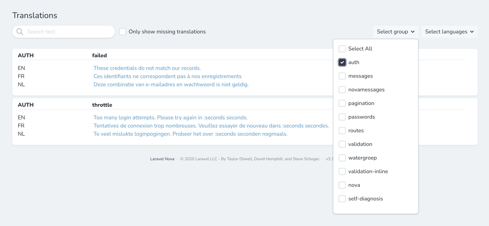

# Laravel Nova Chained Translation Manager

The Laravel Nova Chained Translation Manager allows you to easily edit the translations of your current Laravel environment. 
This translation manager uses the Laravel Chained Translator, that enables you to override the default translations with 
translations for a specific environment, e.g. a content manager can independently edit and override the translation files 
on the production environment from the translations provided by the developers. 

Typically at some point during the development phase, a content manager wants to translate or finetune the translation 
strings added by developers. This often results in merge and versioning issues, when developers and content managers 
are working on the translation files at the same time.  

The Chained Translator package allows translations created by developers to exist separately from translations edited by 
the content manager in separate `lang` directories. The library merges the translations of both language directories, 
where the translations of the content manager (the custom translations) override those of the developer (the default 
translations). Check the documentation of the [Laravel Chained Translator](https://github.com/statikbe/laravel-chained-translator) 
for more info.

## Features

- Save translations of the current environment to separate translation files in a separte language directory to avoid
  version conflicts.
- Immediately save translations
- Search for translations and translation keys
- Filter translations for specific groups and languages
- Only show keys with missing translations 

Currently, this tool does not provide features to add new translation keys, because our target users are translators and 
content managers and we want to avoid that they add unnecessary translation keys.

## Installation

The package can be installed through Composer.

```
composer require statikbe/laravel-nova-chained-translation-manager
```

Next enable the tool in Nova. 
Go to `app/Providers/NovaServiceProvider.php` and add the TranslationManager to the tools.
```php
use Statikbe\NovaTranslationManager\TranslationManager;

    public function tools()
    {
        return [
            new TranslationManager,
        ];
    }

```


## Configuration

You can configure the custom language directory name and extend or finetune the service provider of the Laravel Chained
Translator. Have a look at the configuration options of the [Laravel Chained Translator library](https://github.com/statikbe/laravel-chained-translator). 

### Supported locales

There are two ways to change the supported locales.
 
#### Option 1
Publish the config file with the command below and configure it with your supported locales and editor preferences.

```shell
php artisan vendor:publish --tag=nova-chained-translation-manager
```

E.g.
```php
    /*
    |--------------------------------------------------------------------------
    | Application Supported Locale Configuration
    |--------------------------------------------------------------------------
    |
    | The application locale determines the possible locales that can be used.
    | You are free to fill this array with any of the locales which will be 
    | supported by the application.
    |
    */

    'supported_locales' => [
        'en',
        'nl'
    ],
```

#### Option 2
If your application already has a config that declares your locales than you are able to set the supported locales in 
any service provider. Create a new one or use the `app/Providers/AppServiceProvider.php` and set the supported locales 
as an array in the boot function as follows:

```php
use Statikbe\NovaTranslationManager\TranslationManager;

public function boot()
{
    TranslationManager::setLocales(['en', 'nl']);
}
```

### Changing your Editor
Its possible also to change your editor, sometimes the translations values can get big and its good if you have a larger area
to edit them or even add some bold/underline effects on the fly. You can use 3 supported values: input,textarea,trix. Their names are 
self-explanatory. Please keep in mind while using Trix you should also configure your allowed HTML tags. 
Dont forget to clear the cache after changing these settings and refresh your page to see the results :)

E.g.
```php
    /*
    |--------------------------------------------------------------------------
    | Editor to use
    |--------------------------------------------------------------------------
    |
    | Choose what type of editor you want to use while editing your translations
    | input - For really dead simple input
    | textarea - For a larger textarea to deal with
    | trix - Will use Trix Editor for editing locales supporting some HTML on it.
    |
    | Note : Please keep in mind while using Trix to configure your allowed HTML
    | tags. Otherwise it may pose XSS attacks risk if field could be edited by the end user.
    |
    | Values : trix, input, textarea
    |
    */

    'editor' => 'input',
    'trix_allowed_tags' => '<code><p><b><u><a><br><ul><li><ol><pre><h2><h3><h4><h5><del><blockquote><dl><dd><strong>',
```

### Ignoring Groups
You may also ignore certain groups of translations to be shown in the Nova UI. Create an array with keys that you want to ignore:

E.g.
```php
    /*
    |--------------------------------------------------------------------------
    | Ignore Groups
    |--------------------------------------------------------------------------
    | This will ignore certain groups from the translations UI
    | Supports an array of keys
    |
    */

    'ignore_groups' => ['auth','pagination','passwords','routes','nova','nova/validation'],
```

## Merging translations

You can combine the custom translations of the current environment with the default translation files, by running the
command provided by the [Laravel Chained Translator library](https://github.com/statikbe/laravel-chained-translator) package.

## Credits

We used [Joe Dixon's](https://github.com/joedixon) translation libraries as a source of technical expertise and inspiration:
- [Laravel Translation](https://github.com/joedixon/laravel-translation)
- [Nova Translation](https://github.com/joedixon/nova-translation)

Thanks a lot for the great work!

## License
The MIT License (MIT). Please see [license file](LICENSE.md) for more information.

## Screenshots





